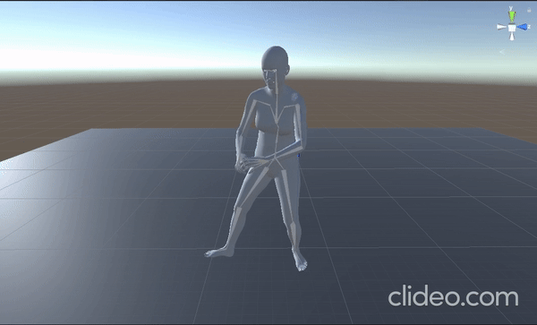

# GRF_MV:Ground Reaction Force Estimation from Monocular Video

<div align="center">


</div>

<a href="assets/GRF_MV_Ground_Reaction_Force_Estimation_from_Monocular_Video.pdf">
    
</a>

## Project Description

This is the repository for the project "GRF_MV: Ground Reaction Force Estimation from Monocular Video" for final year personal project at the University of Birmingham. The project aims to estimate the Ground Reaction Force (GRF) from monocular video using a hybrid approach. The hybrid approach combines the strengths of two state-of-the-art methods, HybrIK-X and physics-based optimisation, to estimate the GRF. The results are evaluated on the GroundLink dataset and compared with the ground truth GRF. Visualisation of the estimated GRF is also provided in Unity.

## Installation instructions
Installing nessesary environment and dependencies from HybrIK-X.

``` bash
# 1. Create a conda virtual environment.
conda create -n GRF_MV python=3.8 -y
conda activate GRF_MV

# 2. Install PyTorch
conda install pytorch==1.9.1 torchvision==0.10.1 -c pytorch

# 4. Pull our code
git clone https://git.cs.bham.ac.uk/projects-2023-24/jxk010.git
cd jxk010

# 5. Install
pip install pycocotools
python setup.py develop  # or "pip install -e ."
```
GroundLink might require newer version of Python and Pytorch. Please refer to the [GroundLink](https://github.com/hanxingjian/GroundLink)


## Downloads
Directory under `$root/HybrIK` should look like this:

    ├── configs
    ├── examples
    ├── hybrik
    ├── hybrik.egg-info
    ├── model_files
    ├── pretrained_models
    ├── scripts
    └── setup.py

Within this, `pretrained_models` directory should contain the following files:

    └── hybrikx_hrnet.pth

Download necessary model files from [[Google Drive](https://drive.google.com/file/d/1un9yAGlGjDooPwlnwFpJrbGHRiLaBNzV/view?usp=sharing)] and un-zip them in the `${root/HybrIK}` directory.

HybrIK-X pretrained model is available for download from [[model]](https://drive.google.com/file/d/1bKIPD60z_Im4S3W2-rew6YtOtUGff6-v/view?usp=sharing) and its configuration [[cfg]](configs/smplx/256x192_hrnet_smplx_kid.yaml).

Directory under `$root/GroundLink` should look like this:

    ├── Visualization  
    │   ├── aitviewer
    │   └── models              
    ├── GRF                     
    │   ├── checkpoints         
    │   ├── Data               
    │       ├── fbx       
    │       ├── Force 
    │       ├── moshpp
    │       ├── AMASS
    │   ├── ProcessedData 
    │   └── scripts
    └── NN

Models can be downloaded from [SMPL-X](https://smpl-x.is.tue.mpg.de/) official website.

To install aitviewer (locally) with force plate coordinates setup:
```
cd (root)/GroundLink/Visualization
git clone git@github.com:eth-ait/aitviewer.git
mv forceplate.py aitviewer/
```

GroundLink Dataset can be downloaded from [GroundLink](https://csr.bu.edu/groundlink/) under the `$root/GroundLink` directory. Also download [AMASS](https://amass.is.tue.mpg.de/) and place it under `Data/AMASS` directory.
For Unity [Motion](https://bham-my.sharepoint.com/personal/jxk010_student_bham_ac_uk/Documents/Motions?csf=1&web=1&e=YFhQER) can be downloaded. Add them to `Motions` directory under `GRF_NV Unity assets`.

## Running the demo
To produced 3D mesh recovered result from HybrIK-X
``` bash
cd HybrIK
python scripts/demo_video_x.py --video-name examples/dance.mp4 --out-dir res_dance --save-pk --save-img
```

To test out the GroundLink pipeline
``` bash
cd GroundLink/GRF/scripts
python preprocess.py
```

This will save the processed data in `ProcessedData` directory. To run the model on the processed data:
``` bash
cd (root)/GroundLink/ProcessedData/S7
mkdir test
cp preprocessed/*.pth test/

cd (root)/GroundLink/GRF/scripts
python predict.py
```
Change the `S7` to `S4` to test on different subjects.

``` python
cd GroundLink/Visualization
python view_results.py
```
This will visualize the results graph of the predicted GRF and Ground Truth data from GroundLink dataset.

To run Unity feet optimization:
1, Download SMPL-X Unity add-on from [SMPL-X](https://smpl-x.is.tue.mpg.de/)
2, Open Unity and add files and folders in `GRF_NV Unity assets` under assets folder in Unity.
3, Select scenes from `GRF_NV Unity assets/Scenes` and run the scene.

Please make sure to monitor scene tab for Ground Reaction Force visualization. Forces are extracted to console and saved at log file.

## Citation
If you find this work useful, please consider citing:
``` bibtex
@misc{katsu2023grfmv,
title={GRF_MV: Ground Reaction Force Estimation from Monocular Video},
author={Juni Katsu and Esha Dasgupta and Hyung Jin Chang},
year={2023},
archivePrefix={arXiv},
primaryClass={cs.CV}
}
```